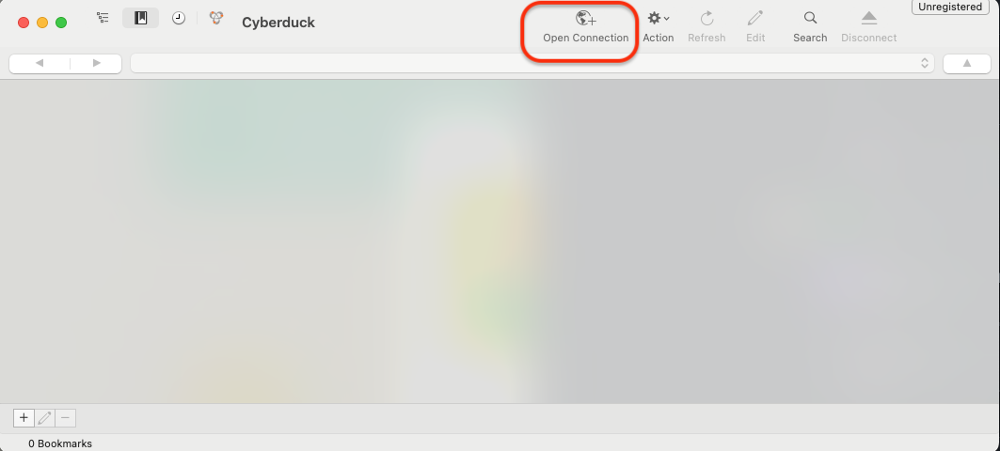
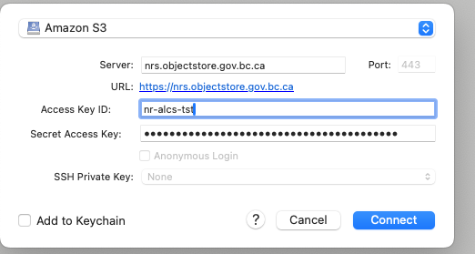
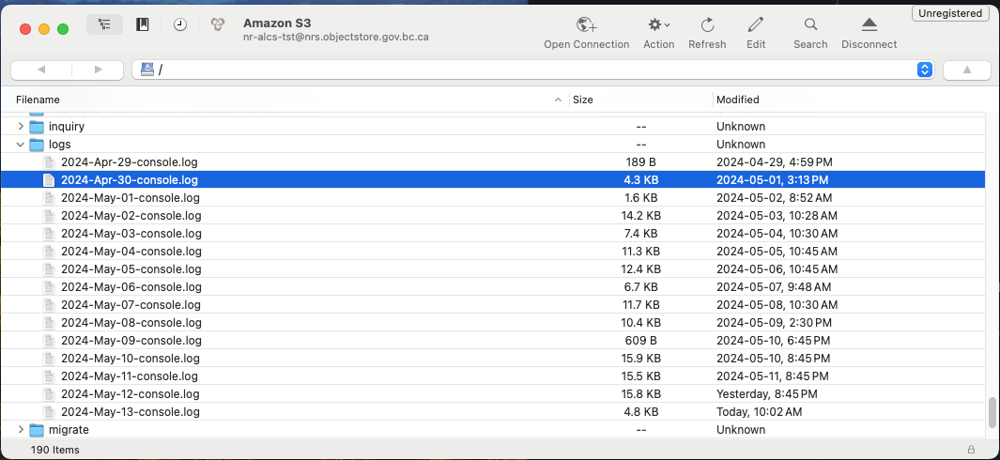

# Security Logs
As a security requirement the API logs are stored indefinitely on Openshift DELL ECS storage. In order to access logs you will need to download log files from Openshift with a tool of your choice, for example Cyberduck.
Log files are simple text files that follow the naming convention "[DATE]-console.log".

## Instructions on how to download log files using the Cyberduck (using TEST environment)
1. Download and Install Cyberduck from the official website (at the time of writing [https://cyberduck.io](https://cyberduck.io)),
2. Run Cyberduck and click "Open connection", 
3. In opened modal select "Amazon S3" type connection,
4. Populate the server field with "nrs.objectstore.gov.bc.ca",
5. Populate Access Key ID and Secret Access Key with corresponding DELL ECS bucket credentials (credentials are stored in API configuration in Vault. Reach out to whoever has the necessary permissions to access the secrets in Vault),

6. Hit the "Connect" button,
7. Once connected, navigate to the bucket (in the case of TEST env it is "ckbdwh") and locate the "logs" folder,
8. Once in the "logs" folder, simply drag and drop a log file that you are interested in on your local machine and open it with the text editor of your choice.
